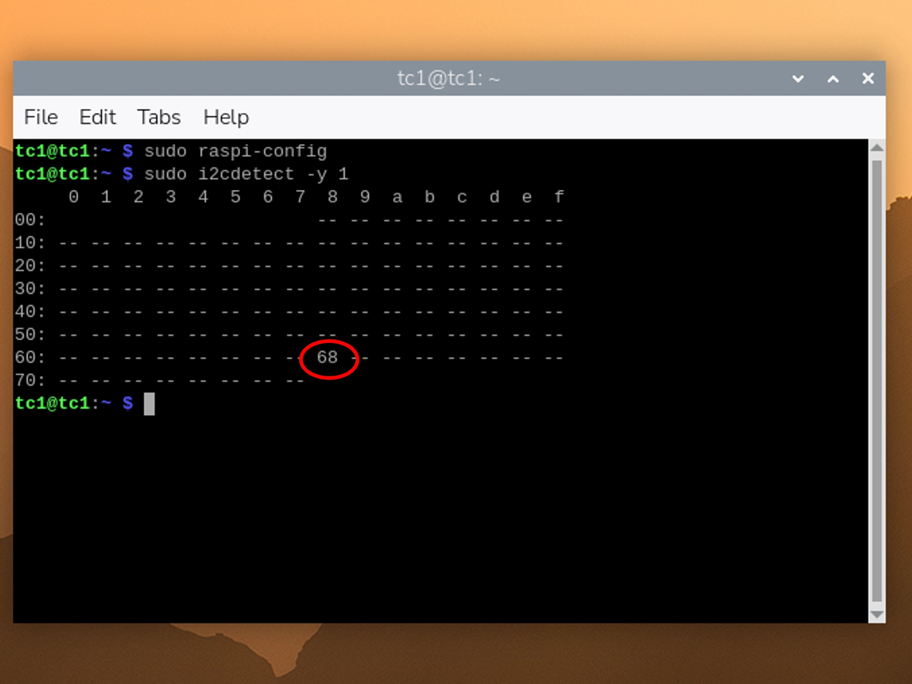
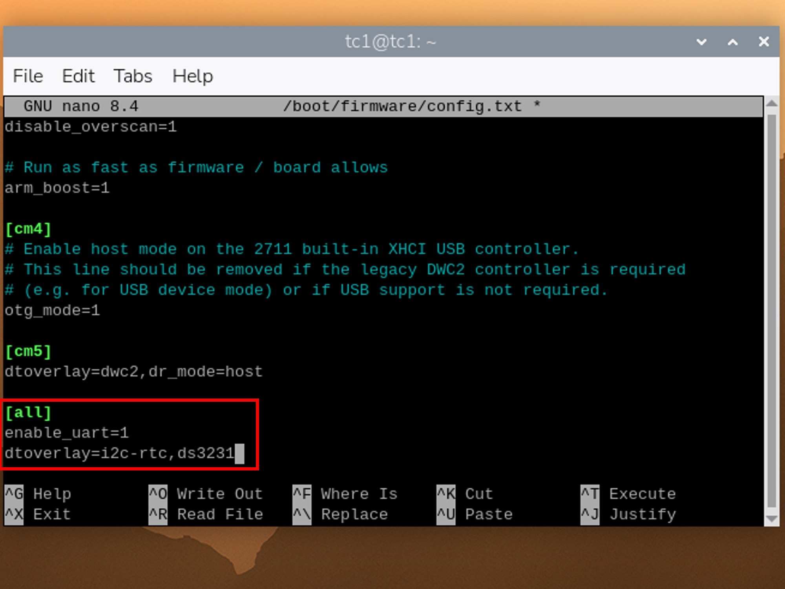
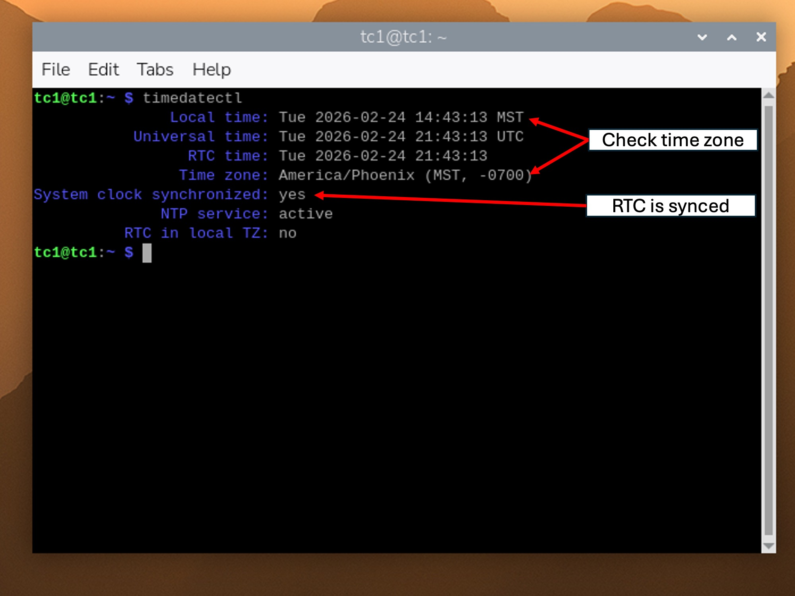
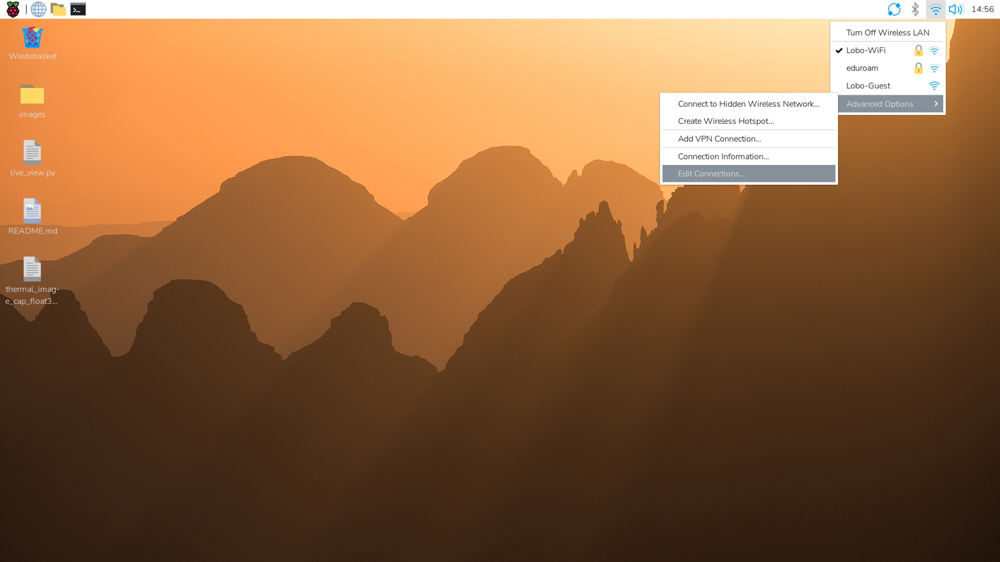
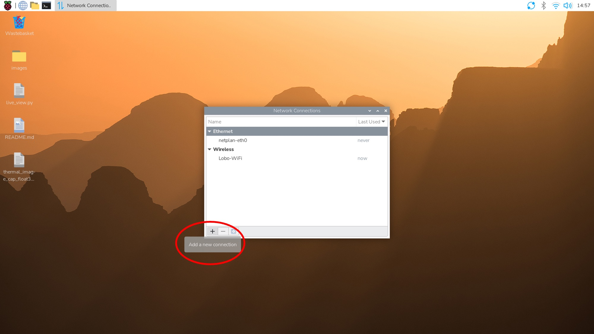
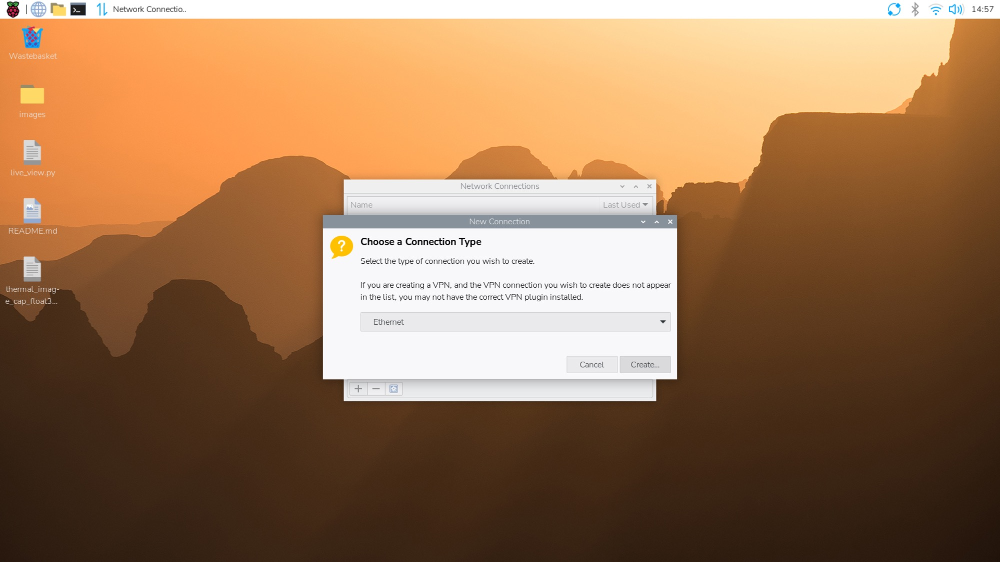
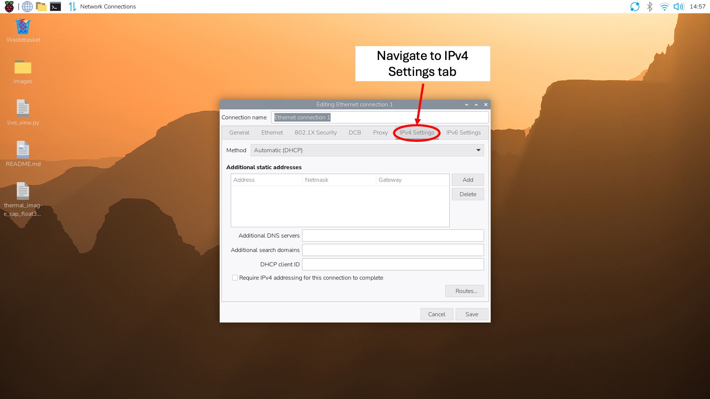
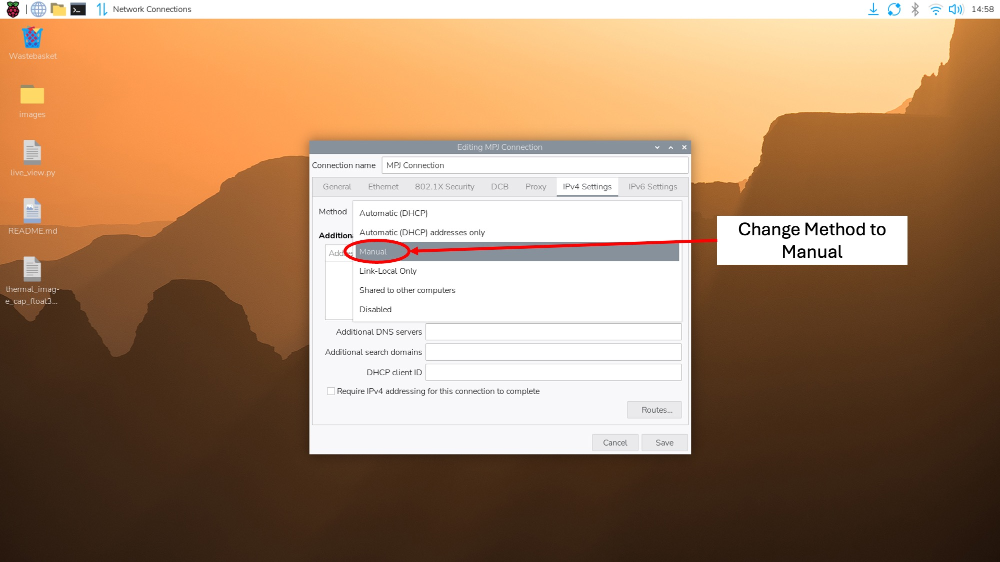
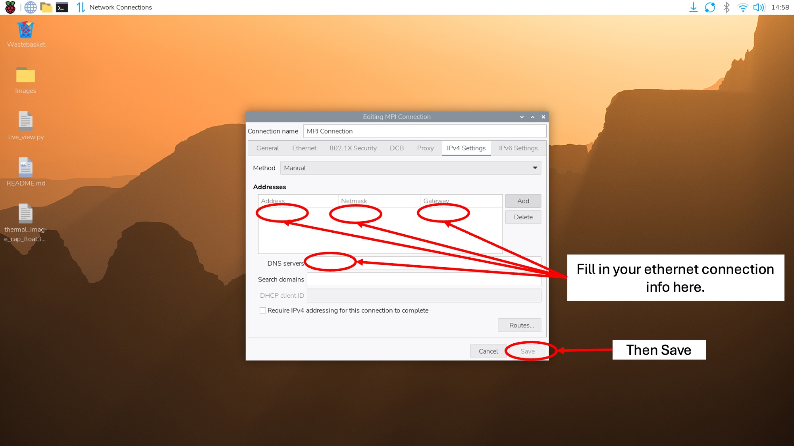

# raspberry-pi-thermal-camera

Workflow and scripts for setting up Raspberry Pis to run thermal cameras
for field deployments (MPJ site).

This setup:

-   captures thermal images every 15 minutes

-   saves them locally with timestamps

-   logs output for debugging

cd \~/Desktop

git clone <https://github.com/dekdurk/raspberry-pi-thermal-camera.git>

# packages to download

Currently I use `sudo apt install python3-` to do this, since i
typically run into issues using `pip` where the packages can't be found.

Only two required packages:

-   `sudo apt install python3-opencv`

-   `sudo apt install python3-rasterio`

**Note:** In the future, we may switch to a requirements.txt, but for
now `apt` is more reliable on fresh Pi installs.

# Scripts

There are 2 scripts needed for setup:

## 1. `live_view.py`

-   Gets live stream from the thermal camera.

-   Used in initial setup when checking FOV and adjusting focus

After installing the python libraries, I'll plug in the camera, and run
this script to check that:

-   I didn't miss a library,

-   connection works,

-   camera is working,

-   general sanity check before moving on.

## 2. `thermal_image_cap_float32.py`

-   The main script which captures the thermal images.

**You need to edit this script for each pi.**

Go to line 87

Change `save_dir` to where you want the data saved

-   `save_dir = "/home/YOUR_PI_NAME/Desktop/raw_data/"`

Make sure the script:

-   connects to the camera

-   captures an image when called

-   saves images to a known directory

-   prints a timestamp (for logging/debugging)

# Set Up Automatic Capture (crontab)

1.  Open crontab: `crontab -e`

2.  If prompted, select **option 1** (nano editor).

3.  Add this line to the bottom of the file:

    `*15* * * * /usr/bin/python3 /home/tc3b/Desktop/thermal_image_cap_float32.py >> /home/tc3b/Desktop/thermal_capture.log 2>&1`

    -   **What this does:**

        -   runs the script every 15 minutes

        -   logs all output to `thermal_capture.log`

4.  Save and exit:

    -   `Ctrl + O` to save

    -   `Enter`

    -   `Ctrl + X` to exit

    -   `sudo reboot`

5.  Test That It Works

    1.  After reboot wait till you pass the next 15-min mark of the hour
        ( :00, :15, :30, :45)

    2.  Check log file `cat /home/tc3b/Desktop/thermal_capture.log`

        -   You should see timestamps or output from your script.

    3.  Check images directory.

        -   Make sure new images are being created every 15 minutes.

## Notes & Tips

If the script doesn’t run:

-   check log file

-   confirm file path is correct

-   confirm Python path is `/usr/bin/python3`

If camera isn’t detected:

-   make sure OpenCV installed correctly

-   test script manually:
    `python3 /home/tc3b/Desktop/thermal_image_cap_float32.py`

# Set Up Real Time Clock (RTC)

Previously, we used Raspberry Pi 5s, which have RTCs pre-installed, but
needed an watch battery attachment to provide constant power.

The Raspberry Pi 3bs do not have pre-installed RTCs, so we have to
install them on the pins and set it up.

## 1. Install DS3231 RTC

Here we use DS3231 RTCs.

{width="128"}

Each Pi uses a DS3231 RTC module so it keeps correct time in the field
without WiFi.

[{width="490"}](https://www.raspberrypi.com/documentation/computers/raspberry-pi.html)

Connect the DS3231 to pins 1,3,5, 7, & 9

Here is what is should look like when installed:

{width="245"} {width="308"}

## 2. Enable I2C

Open config tool: `sudo raspi-config`

Navigate to: `Interface Options → I2C → Enable`

Reboot if prompted.

[I2C Visual Guide (PDF)](readme_supplemental/enable_i2c.pdf)

## 3. Confirm RTC is detected

Run: `sudo i2cdetect -y 1`

You should see address: `68`

{width="342"}

If you do not see `68`, check wiring and battery charge.

## 4. Enable RTC overlay

Edit config file: `sudo nano /boot/firmware/config.txt`

-   **Note:** Was previously `/boot/firmware/config.txt` and might be
    recomended by forums online, but you'll be prompted to go to
    `/boot/firmware/config.txt`

Add this line at the bottom:`dtoverlay=i2c-rtc,ds3231`

{width="342"}

Save and exit:
       
-   `Ctrl + O` to save

-   `Enter`

-   `Ctrl + X` to exit

-   `sudo reboot`

## 5. Disable the fake hardware clock

The internet claims that the Pi uses a fake clock by default, but every
time I try this on the Pi 3bs it shows that the module doesn't exist. So
you can try the following code, but I think it's useless.

1.  `sudo apt remove fake-hwclock`

2.  `sudo update-rc.d -f fake-hwclock remove`

3.  `sudo systemctl disable fake-hwclock`

## 6. Verify time

`timedatectl`

Make sure:

-   correct local time
-   time zone set correctly
    -   I use America/Phoenix (aka MST) to avoid daylight savings issues
        and since the tower data is on MST
    -   It is okay if the RTC is not in local time. As long as it's
        synced and the Pi knows to adjust to local time, all should be
        well.

{width="342"}

## 8. Test RTC (IMPORTANT before field deployment)

1.  Turn off WiFi

    -   Insert Image here

2.  Unplug Pi from power

3.  Wait \~5–10 minutes

4.  Power Pi back on (no internet)

5.  Check Time

The time should still be correct. If not, the RTC is not configured
correctly.

# Set up Ethernet

## Set static IP (desktop method)

Click network icon (top right)

Go to Edit Connections

{width="600"}

Add a new connection

{width="600"}

Select Ethernet

{width="600"}

Go to the IPv4 settings tab

{width="600"}

Change the connection method to Manual

{width="600"}

Enter:

-   IP address you want the pi to connect to

-   Netmask (i.e. Subnet Mask)

-   Gateway

-   DNS

Save

{width="600"}

After this, the pi should automatically connect to the IP address when
the Ethernet cable is plugged in.

# Future Improvements

-   [ ] convert to `requirements.txt`
-   [ ] add info on PiConnect
-   [ ] Add rasppi imager info
